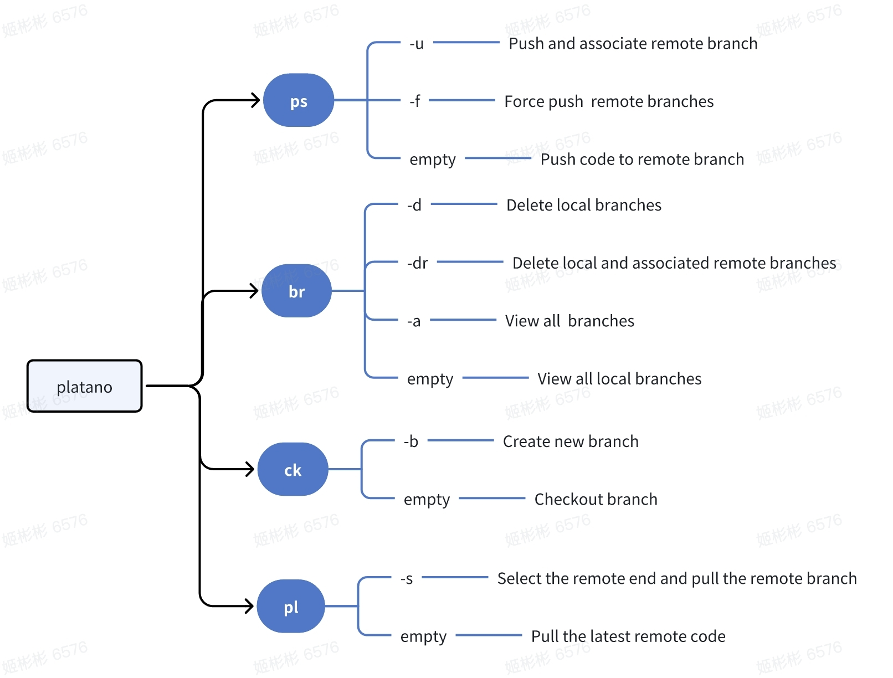

# platano-git

> A tool for simplifying **git** operations

## User Guidance

### Install

#### Using [npm](https://www.npmjs.com/):

```
npm install platano-git -g
```

#### Using [yarn](https://yarnpkg.com/):

```
yarn global add platano-git
```

### Guide



## Feedback

If you encounter problems or have good ideas and suggestions, please [report](https://github.com/chouchouji/platano-git/issues) here.

## License

[MIT](LICENCE)