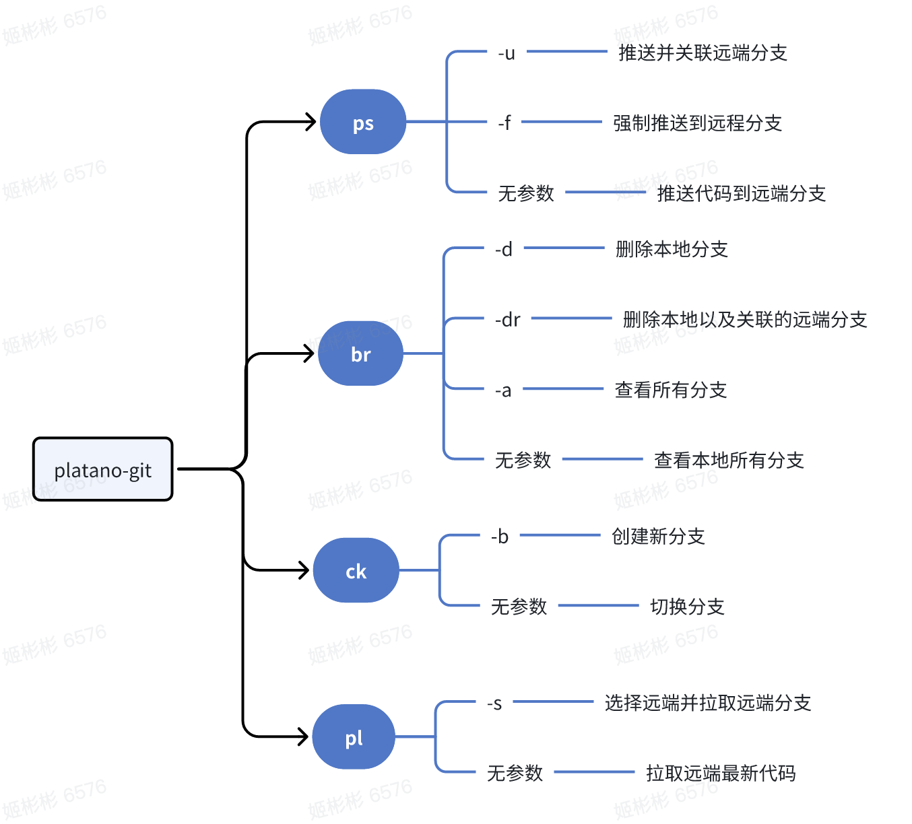

# platano-git

> 一个用于简化 **git** 操作的工具

## 使用指南

### 安装

#### 使用 [npm](https://www.npmjs.com/):

```
npm install platano-git -g
```

#### 使用 [yarn](https://yarnpkg.com/):

```
yarn global add platano-git
```

### 指南



## 反馈

如果遇到了问题或有好的想法和建议，请在此 [报告](https://github.com/chouchouji/platano-git/issues) 。

## 许可证

[MIT](LICENCE)
